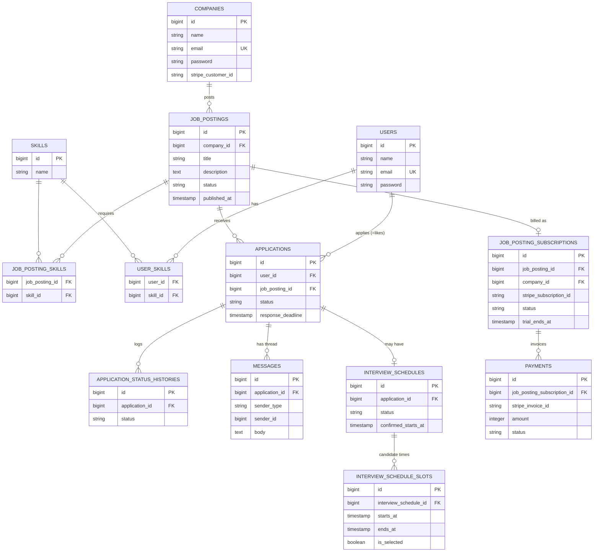

# DB設計

`REQUIREMENTS.md` の内容をもとにしたテーブル設計。DBはPostgreSQLを想定。

## 1. ER図

`notifications` は Laravel標準の polymorphic notifications テーブルを使用するため、上記ER図には含めていない(`notifiable_type` / `notifiable_id` で `users` / `companies` の両方を参照)。

## 2. テーブル定義

### users(求職者)
| カラム | 型 | 制約 | 備考 |
|---|---|---|---|
| id | bigint | PK | |
| name | string | not null | |
| email | string | unique, not null | ログインID |
| email_verified_at | timestamp | nullable | |
| password | string | not null | |
| phone_number | string | nullable | |
| birthdate | date | nullable | |
| bio | text | nullable | 自己PR・経歴 |
| created_at / updated_at | timestamp | | |

### companies(企業。1社1アカウント)
| カラム | 型 | 制約 | 備考 |
|---|---|---|---|
| id | bigint | PK | |
| name | string | not null | 会社名 |
| email | string | unique, not null | ログインID |
| email_verified_at | timestamp | nullable | |
| password | string | not null | |
| phone_number | string | nullable | |
| description | text | nullable | 会社概要 |
| website_url | string | nullable | |
| prefecture | string | nullable | 所在地 |
| stripe_customer_id | string | nullable, unique | Stripe顧客ID |
| created_at / updated_at | timestamp | | |

### skills(スキルマスタ)
| カラム | 型 | 制約 |
|---|---|---|
| id | bigint | PK |
| name | string | unique, not null |

### job_postings(求人)
| カラム | 型 | 制約 | 備考 |
|---|---|---|---|
| id | bigint | PK | |
| company_id | bigint FK → companies.id | not null | |
| title | string | not null | |
| description | text | not null | |
| employment_type | string(enum) | not null | `full_time` / `part_time` / `contract` |
| work_style | string(enum) | not null | `remote` / `onsite` / `hybrid` |
| position_level | string(enum) | nullable | `junior` / `mid` / `senior` |
| min_experience_years | integer | nullable | 必要経験年数 |
| prefecture | string | nullable | 勤務地 |
| salary_min | integer | nullable | |
| salary_max | integer | nullable | |
| status | string(enum) | not null, default `draft` | `draft` / `published` / `unpublished` / `closed`(下記参照) |
| published_at | timestamp | nullable | 初回公開日時。無料期間の起算点 |
| created_at / updated_at | timestamp | | |

`status` の意味:
- `draft`: 作成済み・未公開
- `published`: 公開中(検索結果に表示)
- `unpublished`: 支払い未了により自動非公開(表示されないが企業側で確認・支払い登録可能)
- `closed`: 企業が募集終了(恒久的に非表示)

### job_posting_skills(求人に必要なスキル・中間テーブル)
| カラム | 型 | 制約 |
|---|---|---|
| job_posting_id | bigint FK → job_postings.id | PK(複合) |
| skill_id | bigint FK → skills.id | PK(複合) |

### user_skills(求職者のスキル・中間テーブル)
| カラム | 型 | 制約 |
|---|---|---|
| user_id | bigint FK → users.id | PK(複合) |
| skill_id | bigint FK → skills.id | PK(複合) |

### applications(応募 = 求職者からの「いいね」)
求職者が求人に「いいね」した時点でレコードが作成される。「いいね」は求職者の応募意思そのものであり、`likes`という別テーブルは持たない。

| カラム | 型 | 制約 | 備考 |
|---|---|---|---|
| id | bigint | PK | |
| user_id | bigint FK → users.id | not null | |
| job_posting_id | bigint FK → job_postings.id | not null | |
| status | string(enum) | not null, default `applied` | `applied` / `expired` / `matched` / `screening` / `interviewing` / `offered` / `rejected` / `withdrawn`(下記参照) |
| applied_at | timestamp | not null | 求職者が「いいね」した日時 |
| response_deadline | timestamp | not null | `applied_at` + 7日。企業の反応期限 |
| company_responded_at | timestamp | nullable | 企業が「気になる」を押した日時 |
| created_at / updated_at | timestamp | | |

- unique制約: `(user_id, job_posting_id)`(同一求人への重複応募・重複いいねを防止)

`status` の意味:
- `applied`: 求職者がいいね(応募)した直後。企業の反応待ち
- `matched`: 企業が7日以内に「気になる」を押し、マッチ成立。メッセージ開始可能
- `expired`: 7日以内に企業の反応がなく自動的に不成立(バッチ処理で更新)
- `screening` 以降: マッチ成立後の選考プロセス(企業が任意に更新)

### application_status_histories(選考ステータス変更履歴)
| カラム | 型 | 制約 | 備考 |
|---|---|---|---|
| id | bigint | PK | |
| application_id | bigint FK → applications.id | not null | |
| status | string(enum) | not null | 変更後のステータス |
| changed_by_type | string | not null | `user` / `company` |
| changed_by_id | bigint | not null | |
| created_at | timestamp | | |

### messages(応募単位のメッセージスレッド)
| カラム | 型 | 制約 | 備考 |
|---|---|---|---|
| id | bigint | PK | |
| application_id | bigint FK → applications.id | not null | |
| sender_type | string | not null | `user` / `company` |
| sender_id | bigint | not null | |
| body | text | not null | |
| read_at | timestamp | nullable | |
| created_at | timestamp | | |

### interview_schedules(面接日程調整)
| カラム | 型 | 制約 | 備考 |
|---|---|---|---|
| id | bigint | PK | |
| application_id | bigint FK → applications.id | not null, unique | 1応募につき1件 |
| status | string(enum) | not null, default `proposed` | `proposed`(候補日提示中) / `confirmed`(確定) / `cancelled` |
| method | string(enum) | nullable | `online` / `onsite` |
| location_or_url | string | nullable | |
| confirmed_starts_at | timestamp | nullable | 確定した面接日時 |
| created_at / updated_at | timestamp | | |

### interview_schedule_slots(面接候補日時)
| カラム | 型 | 制約 | 備考 |
|---|---|---|---|
| id | bigint | PK | |
| interview_schedule_id | bigint FK → interview_schedules.id | not null | |
| starts_at | timestamp | not null | |
| ends_at | timestamp | not null | |
| is_selected | boolean | not null, default false | 求職者が選択した候補 |
| created_at | timestamp | | |

### job_posting_subscriptions(求人ごとのサブスクリプション課金)
| カラム | 型 | 制約 | 備考 |
|---|---|---|---|
| id | bigint | PK | |
| job_posting_id | bigint FK → job_postings.id | not null, unique | 1求人につき1件 |
| company_id | bigint FK → companies.id | not null | 検索用に非正規化 |
| stripe_subscription_id | string | nullable, unique | Stripe側のsubscription ID |
| stripe_price_id | string | nullable | 月額1,000円のPrice ID |
| status | string(enum) | not null, default `trialing` | `trialing` / `active` / `past_due` / `canceled` / `unpaid`(Stripeのステータスに準拠) |
| trial_ends_at | timestamp | not null | `published_at` + 14日 |
| current_period_start | timestamp | nullable | |
| current_period_end | timestamp | nullable | |
| created_at / updated_at | timestamp | | |

### payments(請求履歴)
| カラム | 型 | 制約 | 備考 |
|---|---|---|---|
| id | bigint | PK | |
| job_posting_subscription_id | bigint FK → job_posting_subscriptions.id | not null | |
| stripe_invoice_id | string | unique, not null | |
| amount | integer | not null | 円単位(1000) |
| status | string(enum) | not null | `paid` / `failed` / `pending` |
| paid_at | timestamp | nullable | |
| created_at | timestamp | | |

### notifications(アプリ内通知。Laravel標準テーブルを使用)
| カラム | 型 | 制約 | 備考 |
|---|---|---|---|
| id | uuid | PK | |
| type | string | not null | 通知クラス名 |
| notifiable_type | string | not null | `App\Models\User` / `App\Models\Company` |
| notifiable_id | bigint | not null | |
| data | json | not null | 通知内容(メッセージ, リンク等) |
| read_at | timestamp | nullable | |
| created_at / updated_at | timestamp | | |

## 3. 補足

- **求職者/企業の認証分離**: `users` と `companies` は別テーブル・別Sanctumガードで管理する(1社1アカウントのため `companies` がそのままログイン主体を兼ねる)。
- **メッセージの送信者**: `messages.sender_type` / `sender_id` は簡易ポリモーフィック。Eloquentの`morphTo`を使用してもよい。
- **課金と公開状態の連動**: `job_postings.status` はバッチ処理(Laravel Scheduler)や Stripe Webhook(`invoice.payment_failed` 等)から更新する。`job_posting_subscriptions.status` がStripe側の実体、`job_postings.status` はアプリの表示制御用という役割分担。
- **マッチ失効バッチ**: Laravel Schedulerで定期的に `applications` を走査し、`status = applied` かつ `response_deadline` を過ぎているレコードを `status = expired` に更新する。
- **支払い方法の登録タイミング**: 求人投稿時にカード登録は必須にしない。無料期間中(`trial_ends_at`まで)は`stripe_subscription_id`が未設定のまま`status = trialing`で公開できる。期限が近づいたら`notifications`でリマインドし、`trial_ends_at`時点でカード未登録・決済失敗なら`job_posting_subscriptions.status = unpaid`、`job_postings.status = unpublished`にバッチ/Webhookで更新する。
- **面接候補日の提示**: `interview_schedule_slots`は企業のみが作成する(求職者は`is_selected`を選ぶだけで候補日は出せない)。日程を提示する前に、実際の日時調整は`messages`でのやり取りを想定し、企業が最終候補として確定的な日時を`interview_schedule_slots`に登録する運用とする。候補日が全てNGだった場合は、新しいレコードを作らず同一`interview_schedules`を`status = proposed`に戻し、`interview_schedule_slots`を入れ替えて再提示する。
- **インデックス方針**: 検索性能のため `job_postings(status, prefecture)`、`job_posting_skills(skill_id)`、`applications(user_id)`, `applications(job_posting_id)`、`messages(application_id, created_at)` あたりに複合/単一インデックスを張る想定。

## 4. 未決事項
- `employment_type` / `work_style` / `status` 系のenumをDB上で `enum型` にするか、Laravel側でバリデーションする `string + check制約` にするか(PostgreSQLのenum変更のしにくさを考慮すると後者が無難)
